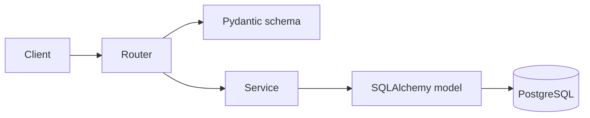

# Cinema API


REST API для онлайн-кинотеатра: управление фильмами, залами, сеансами и бронированием мест. Доступ к ресурсам защищён JWT-аутентификацией, выход из системы реализован через чёрный список токенов. Проект разворачивается в Docker и использует PostgreSQL с миграциями Alembic.

## Функциональность

- Регистрация и аутентификация пользователей (JWT)
- Logout через блокировку токена (token blacklist)
- Деактивация аккаунта (soft delete)
- CRUD фильмов
- Управление залами и сеансами
- Бронирование мест на сеанс с проверкой бизнес-правил (сеанс существует и ещё не прошёл)
- Логирование запросов через middleware
- Ограничение частоты запросов (rate limiting) на эндпоинтах авторизации
- Контейнеризация через Docker Compose
- Покрытие тестами (pytest)

## Технологии

- Python 3.12
- FastAPI
- PostgreSQL
- SQLAlchemy 2.0
- Alembic
- Pydantic v2
- PyJWT + bcrypt
- SlowAPI (rate limiting)
- Docker / Docker Compose
- Pytest

## Архитектура

Слоистая архитектура: роутеры принимают запросы, сервисы содержат логику работы с БД, модели описывают таблицы, схемы валидируют данные.

```
app/
├── routers/        # HTTP-эндпоинты (auth, movies, halls, sessions, bookings)
├── services/       # Бизнес-логика и работа с БД
├── models/         # SQLAlchemy-модели (таблицы)
├── schemas/        # Pydantic-схемы (валидация и сериализация)
├── dependencies/   # Зависимости FastAPI (текущий пользователь)
├── middleware/     # Логирование запросов
├── core/           # Конфигурация, безопасность, лимитер
├── db/             # Подключение к БД, базовый класс моделей
└── alembic/        # Миграции
```

Поток обработки запроса:



## Запуск проекта

```bash
# 1. Клонировать репозиторий
git clone <repo-url>
cd cinemabackend

# 2. Создать .env на основе примера
cp .env.example .env

# 3. Запустить контейнеры
docker compose up --build
```

При старте контейнера миграции применяются автоматически.

Swagger UI доступен по адресу `http://localhost:8000/docs`.

При первом запуске база автоматически наполняется тестовыми данными (демо-пользователь, фильм, зал и сеанс). Войти можно под `demo@demo.com` / `password123`.

## Переменные окружения

Описаны в `.env.example`:

| Переменная | Назначение |
|------------|------------|
| `DATABASE_URL` | Строка подключения к PostgreSQL |
| `SECRET_KEY` | Ключ для подписи JWT (рекомендуется ≥ 32 символов) |
| `ALGORITHM` | Алгоритм подписи токена (HS256) |
| `ACCESS_TOKEN_EXPIRE_MINUTES` | Время жизни access-токена |

## API

| Группа | Префикс | Назначение |
|--------|---------|------------|
| Auth | `/auth` | Регистрация, логин, логаут, деактивация |
| Movies | `/movies` | Управление фильмами |
| Halls | `/halls` | Управление залами |
| Sessions | `/sessions` | Управление сеансами |
| Bookings | `/bookings` | Бронирование мест |

Полная интерактивная документация — в Swagger UI (`/docs`).

## Дальнейшее развитие

- Роли и разграничение прав (admin / user)
- Места в зале и контроль занятости при бронировании
- Автоматическое снятие неактуальных сеансов
